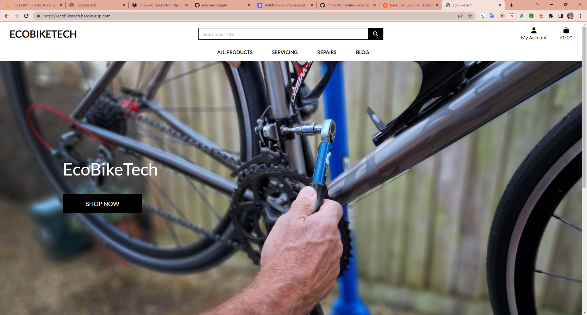
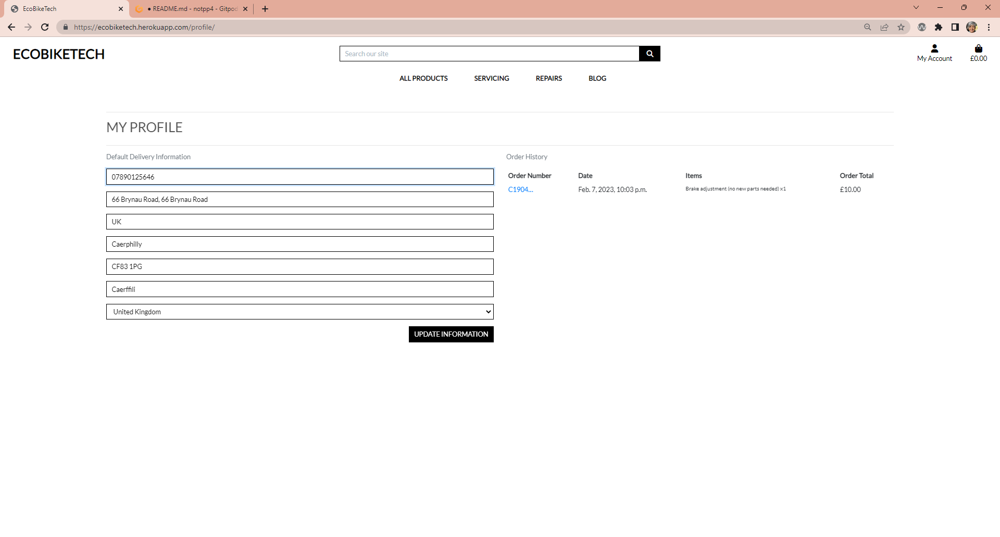

# EcoBikeTech

## Table of Contents
- [**Project purpose and introduction**](#Project-purpose-and-introduction)
- [**UXD – User Experience Design**](#UXD)
- [**Features**](#Features)
- [**Technologies and Resources used**](#Technologies)
- [**Testing**](#Testing)
- [**Project barriers and solutions**](#Barriers)
- [**Version Control**](#Version-Control)
- [**Deployment**](#Deployment)
- [**Credits**](#Credits)
- [**Acknowledgments**](#Acknowledgments)
# 1. Project purpose and introduction

The project was designed to showcase advanced coding abilities as part of the Code Institute Fullstack Web Developer Course. It mainly utilizes HTML, CSS, JavaScript, Python + Django, with Bootstrap as an additional framework. Payments are handled through Stripe, and data is stored in a Heroku Postgres relational database. The goal of the project is to create a full-featured e-commerce application that allows users to view products, add them to their cart and make secure purchases, 

# EcoBikeTech

[**To view the live project ---> Click Here**](https://ecobiketech.herokuapp.com/)

EcoBikeTech is a full-featured application for an existing brand that enables users to interact with the website. The goal of the app is to provide ecommerce functionality to their current offerings, allowing users to store their information for future orders and make secure purchases. The website also includes a blog section where the site owner can post useful bike maintenance information and readers can comment. This feature is expected to drive traffic back to the site, increasing the opportunity for purchases. The website is designed to be easily accessible on any device, including phones, tablets, and computers, allowing users to access it at any time and from anywhere.  The app is designed for accessibility on all devices and has the potential for future expansion with additional features.

# UXD

### **Strategy**

The potential users of this application are cyclists of all levels and types who are in need of bike maintenance information and products. The application provides an easy and convenient way for them to access the information they need, make purchases and store their information for future orders. The blog section of the application also caters to this target audience by providing them with useful and relevant content.

### **User Stories**

- As a store owner, I want to be able to manage the product inventory, including the ability to add products, in order to keep their offerings up-to-date and accurate.
- As a store owner, I wish to have the ability to change product prices, descriptions, images, and other criteria as needed, in order to keep my store up to date and accurate.
- As a store owner, I want the ability to remove products that are no longer available for sale, in order to keep my store's inventory current and accurate.
- As a store owner, I want to be able to provide secure payment options for my customers, in order to ensure their personal and financial information is protected and to build trust with them.
- As a store owner, I want to be able to add interesting and relevant blog posts to the website in order to drive traffic and engage potential customers. These blog posts could cover topics such as bike maintenance tips, product reviews, industry news, and more, in order to provide value to the target audience and keep them coming back to the site.

> Customer/Shopper Stories 

- As a shopper, I wish to be able to view a list of products, so that I can select  items to purchase
- As a shopper, I wish to be able to view individual product details, so that I can identity the price, descriptionmand view the product image (where one is available)
- As a shopper, I wish to be able to easily view the total of my purchases at any time, so that I can control my shops and avoid spending too much
- As a shopper, I wish to be able to sort a specific category of products, so that I can find the product in a specific category
- As a shopper, I wish to be able to search for a product by name or description, so that I can find the product I wish to buy according to my personal needs
- As a shopper, I wish to be able to easily see the quantity of a product, so that I can ensure I do not accidentally select the wrong product numbers of items
- As a shopper, I wish to be able to view items in my bag to be purchased, so that I can identify the total cost of my purchase and all items I will receive before moving to the final checkout
- As a shopper, I wish to be able to adjust the number of individual items in my bag, so that I can easily make changes to my purchase before checkout
- As a shopper, I wish to be able to easily enter my payment information, so that I can check out quickly and with no hassles
- As a shopper, I wish to be able to feel that my personal and payment information is safe, and secure, so that I can confidently provide the needed information to make a purchase
- As a shopper, I wish to be able to view an order confirmation after checkout, so that I can verify that I have not made any mistakes in my order

> Site User Stories 

- As a user of the website, I wish to have an intuitive navigation menu, so that I can quickly access different sections of the site
- As a user of the website, I wish that design is responsive, so I can look at the page on different sizes of devices
- As a user of the website, I wish to be able to create comment on a post, so I can share an opinion about the post with other users
- As a user of the website, I wish to be able to easily register for an account, so that I can have a personalized account and be able to view and update my profile
- As a user of the website, I wish to be able to easily login or logout, so that I can access my personal account information and update them if needed
- As a user of the website, I wish to be able to easily recover my password in case I forget it, so that I can recover access to my account
- As a user of the website, I wish to be able to receive an email confirmation after registering, so that I can verify that my account registration was successful
- As a user of the website, I wish to be able to have a personalized user profile so that I can view my personal order history and order confirmations, and save my payment information

### **Scope**

Current and further developing and designing skill ability, the website provides:
- A clean User Experience by using technologies mentioned in the introduction - HTML, CSS, JavaScript, Python + Django, Stripe, Heroku
- Easy and intuitive navigation via the navbar with dropdown categories of products and services, and a toggle button for the mobile version
- Informative content that gives a clean and modern impression of the purpose of the website 
- Responsive design allows navigating on different devices
- Interactive features which are focused on providing a functional and appealing space for the user (buy button, bag, account with profile, checkout, blog)
- Landing page with the hero image, introduction paragraph, shop button. Introduction content below with philosophy and services 
- Pieces of key information about each product, like description, price, image
- Clear and simple searching bar to browse for products and keywords
- Informative and simple steps of making a secure purchase, add items to the bag, form for personal and payment information, a list with order details and confirmation
- Secure log out feature
- Data securly stored
- The simple mean of how to create, add, edit and delete Products - reserved for the store owner only 
- The simple mean of how to create, add, edit and delete blog posts - reserved for the store owner only 

### **Structure**

The application's structure prioritises meeting the needs of the users. All pages feature a consistent style and layout, including a navigation bar with clear and modern clickable options, well-designed content. The visual design and overall aesthetic are consistent throughout the entire app.
- **The Navigation Bar** located at the top of the page is consistent and includes the following elements:
    - The brand name which serves as a link to the main page
    - A search bar
    - Names with icons of each site category for easy browsing between them
    - A toggle button that is visible on smaller devices.
- **Home/About Page** - contains:
    - A short introduction paragraph that provides an overview of the brand's purpose and philosophy
    - A hero image that captures the essence of the brand
    - A "Shop" button that directs users to the online store
    - A clear and concise statement of the brand's purpose and philosophy, to inform and connect with visitors. 
- **All Products** Page - contains: 
    - Card panels that showcase all products, each containing:
    - An image that serves as a clickable button for full product details
    - The product name
    - The price

- **Product Detail** - users can see product details and add the product to the cart
    - a description of the product
    - Product Image
    - price
    - the ability to change quantity
    - an add to bag button
- **Register Page** - contains fields to fill up with 'Username' and 'Password' and a 'Register' button, and a link to the 'Log In' Page
- **Log In** Page - contains fields to fill up with 'Username' and 'Password' and a 'Login' button, and a link to the Register Page
- **Profile** Page - contains personal information about a user, address details, and order history, this page is available for registered users
- **Sign Out** link - allows user to log out from the profile to protect a  stored data
- **Shopping Bag** Page - contains an image and name of the product, price, quantity, grand total information, as well as continue shopping and secure checkout buttons for more actions
- **Checkout** Page - contains a form for details, delivery, and payment information, adjust bag and complete order buttons, and order summary with image, name, quantity, subtotal,  and grand total information
- **Blog** Page - contains card panels with the Post Title and date, each card contains an image that acts as a clickable button for the further view of the full post details
- **Post Detail** Page -  contains title, body,  also add comment button
- **Add Comment** Page -  A form that allows the user to add their name and comment to a post, the date is automatically created.

### **Wireframes**
<object data="static/docs/images/ecobiketech_wireframes.pdf" type="application/pdf" width="750px" height="750px">
  <embed>
        
Please download the PDF to view the wireframes: <a href="static/docs/images/ecobiketech_wireframes.pdf">Download PDF</a>.

   </embed>
</object>

A Multi-Page ecommerce Website.

It features a header with a fixed navigation bar, displaying the brand name and a dropdown menu with links to product categories, as well as a search bar for keyword searching.
The website includes the following sections:
Home (which also serves as an About page) that introduces users to the purpose of the store.
An All Products page, along with additional pages for main product categories.
My Account with a dropdown menu for logging in, registering, logging out, accessing the profile, and admin links.
A Shopping Bag and checkout page for purchasing products.

[**Database:**]

A database created for this project consists of models for:
- categories
- products
- users
- users profile
- orders
- order items
- Posts
- Comments 

The models for products, categories posts and comments in this project was created specifically for the project, and the information included (such as imagery, names, and descriptions) can be found in the credit section. SQLite was used during the development process and elephantSQL was used during the production process. The idea for the database of the ecommerce part of the site was taken from the code institute Boutique Ado walkthrough .

### **Surface**

The visual experience of this project reflects the theme of ecofriendly bike maintanence. Clean, no frills.

> Colors

White background black text, images to provide most of colour. 

> Typography

Font 'Lato' was used. The Lato font is a popular choice for websites and applications due to its versatility and legibility. Lato is a sans-serif font that was designed to look good on screens and in print, making it a suitable choice for digital products. It has a clean, modern appearance that works well for a variety of purposes, from body text to headings. Additionally, the Lato font family includes a wide range of weights, allowing designers to create a consistent look and feel across different elements of a product. Overall, Lato's versatility, legibility, and range of weights make it a popular choice among designers and developers..

> Icons 

Icons for cards content and Bag, Account, picked from Font Awesome free collection, the web's most popular icon set, and toolkit. 

> Images 

Imagery collections for home page content were picked from ecobiketech.com with the owners permission, and imagery for products were taken from pixabay. 
The hero image on the Home Page reflects the exact purpose of the site. 

> General Design

The design for this project was largely influenced by the code institute walkthrough project, with plans for enhancing the design and branding in the future. However, due to limited time, the focus shifted to ensuring the functionality of the product, leaving little room for experimentation with the design.

# Features

> Existing Features shown across the pages

The website has been designed with the user experience in mind, making it easy and intuitive to use. The purpose of the website, which includes reading blogs and  shopping, is clearly visible upon first viewing. The user interface is simple and comfortable, with all features clearly defined and guiding users towards their next steps. The navigation bar is consistent throughout the site, making navigation seamless. The names of each page serve as active links that direct users to different sections of content and experiences.

- **Top Navigation Bar** - The navigation bar, which is a prominent feature on every page, has been designed to be fully responsive, allowing users to effortlessly browse the site. Additionally, if a user has items in their shopping cart, the cost of those items is displayed on the screen.

- **Search Bar** -The navigation bar includes a search function, allowing users to easily search for products by name or description. The results display a simple active link that takes the user directly to the page displaying all relevant products.

- **Home/About Page** - The Home/About page serves as an introduction to the site, featuring a hero image with a "Shop Here" button and card panels showcasing the philosophy of environmentally friendly products.
  
- **Alerts/Messages** - Bootstrap toasts provide real-time feedback to users after they take actions related to products, such as adding or deleting items from their shopping cart. Shoppers have full control over their interactions with the page, including the number of items in their cart, the total cost, and updates on successful additions or deletions. The checkout process includes a button to initiate the transaction. 
                

- **Products Store** - The Shop page showcases all available products in a clean and visually appealing layout, displaying four products per row on large screens and one product per row on mobile devices. The standard card design provides an easy-to-use interface, with clear elements and an option to view more details about a product by clicking on its image, which takes the user to the product detail page. 

- **Register/Login/Logout Pages** - These features enable users to create a profile by signing up, log in as a returning customer, and securely log out to save their data for future use. Authentication is provided to ensure protection of the user's information. 
  
 

- **Profile Page** - The user profile includes pre-filled information such as name, county, postcode, street, and a complete history of orders. Users can view previous orders and update their personal and delivery information. Only authenticated users have access to this feature. !

- **Shopping Bag** - The Shopping Bag page is optimized for all devices and displays a product's picture, name, and total cost. Users can adjust the quantity of products in their bag or remove items entirely with the update or delete links. 

> Features left to implement in the future 

- The comments section is only accessible for logged in users and they have the ability to edit or delete their own comments. Supporting the nesting of comments.
- A calendar showing available appointment slots.

# Technologies 
* [**Code Institute Fullstack Web Developer Course Content**](https://codeinstitute.net/) - was used as the main source of fundamental knowledge and inspiration.
* [**Code Institute SLACK” Community**](https://slack.com/intl/en-no/) - was used as a source of assistance.
* **HTML - HTML5 technology** – was used as the main language to create the structure of the Website.
* **CSS - CSS3 technology** – was used as the main language to style the Website.
* **JS - JavaScript technology** – was used as the main language to create the interactive elements of the Website.
* **Python technology** - was used as an interpreted high-level general-purpose back end programming language
* [**Django**](https://www.djangoproject.com/) - Django the web framework for perfectionists with deadlines.
* [**Bootstrap**](https://getbootstrap.com/) - Bootstrap is a free and open-source CSS framework directed at responsive, mobile-first front-end web development.
* [**jQuery**](https://jquery.com/) - the jQuery library was used as an open-source to create interactive features.
* [**Font Awesome**](https://fontawesome.com/) - Font Awesome Icons were used for social media links and marking separate parts of sections.
* [**Google Fonts**](https://fonts.google.com/specimen/Inconsolata) - Google Font used throughout this project
* [**Gitpod**](https://www.gitpod.io/) - Integrated Development Environment was used to develop the Website.
* [**GitHub**](https://github.com/) - GitHub hosting site was used to store the source code for the Website, and Git Pages was used for the deployment of the live version of site.
* [**Git**](https://git-scm.com/) - Git was used as version control software to commit and push code to the GitHub repository where the source code is stored.
* [**Heroku**](https://www.heroku.com) - Cloud Application Platform is a service (PaaS) that enables developers to build, run, and operate applications entirely in the cloud
* [**Stripe**](https://stripe.com/en-no) - an Irish-American financial services and software which offers payment processing software and application programming interfaces for e-commerce websites and mobile applications.
* [**Amazon Web Services**](https://aws.amazon.com/) - subsidiary of Amazon providing on-demand cloud computing platforms and APIs to individuals, companies, and governments, on a metered pay-as-you-go basis.
* [**Stack Overflow**](https://stackoverflow.com/) - was used as a general source of knowledge.
* [**w3schools**](https://www.w3schools.com/howto/default.asp) - was used as a general source of knowledge.
* [**Google Chrome Developer Tools**](https://developers.google.com/web/tools/chrome-devtools) - this built-in developer tool was used to inspect page elements and help debug issues with the site layout and test different styles
* [**Mobile-Friendly Test Tool**](https://search.google.com/test/mobile-friendly) - The Mobile-Friendly test tool was used to check if an application is designed for mobile devices.
* [**Balsamiq Wireframe**](https://balsamiq.com/wireframes/) - these quick and handful tool was used to create wireframes for planning project structure and layout.
* [**Lucidchart**](https://lucid.co/product/lucidchart) - The intelligent diagramming application for every team
* [**Am I Responsive Bookmarklet**](http://ami.responsivedesign.is/) - Multi Device Website Mockup Generator was used to create the Mockup image for this README file.
* [**Make a README**](https://www.makeareadme.com/) – a page that shows suggestions on how to create a good Readme file.
* [**Examples of README**](github.com) - examples of readme found in repositories on github
* [**Mastering Markdown**](https://guides.github.com/features/mastering-markdown/)– GitHub guide about Markdown. Lightweight and easy-to-use syntax for styling all forms of writing on the GitHub platform.
* [**W3C Markup Validation Service**](https://validator.w3.org/) - validator was used to check the markup validity of content in HTML and CSS.
* [**JSHint**](https://jshint.com/) - was used as tool that helps to detect errors and potential problems in JavaScript code.
* [**Json Formatter**](https://jsonformatter.curiousconcept.com/) - was used as json file formatter and validator
* [**Json Online Viewer**](https://countwordsfree.com/jsonviewer) - was used to display json file tree view for data base fixtures 
* [**Flake8**](http://pep8online.com/) - was used as tool check the code for PEP8 requirements
* [**Google Python Style Guide**](https://google.github.io/styleguide/pyguide.html#383-functions-and-methods) - was used as root of information about Python rules
* [**Closing Tag Checker for HTML5**](https://www.aliciaramirez.com/closing-tags-checker/) - was used to validate if all tags are open and close correctly.
* [**HTML and CSS and JS Formatter**](https://webformatter.com/html) - Free online tool to format an ugly HTML code, making it readable and pretty, with the proper indentation.
* [**Black**](https://black.vercel.app/) - The uncompromising Python code formatter.
* **Microsoft Paint** - a simple raster graphics editor has been used for editing and resizing pictures.

# Testing

The final result of this project is a full-stack, front-end and back-end web application based on the principles of user experience design, accessibility, and functionality. 
**This is an interactive front-end and back-end web application developed and implemented by using HTML, CSS, JavaScript, Python+Django, with additional Bootstrap elements**, testing was performed based on the website's functionality for obtaining and saving data, visual impacts, layout, and user interactions during navigation and purchasing products.

**Testing results :** ---> please click [**HERE**](static/docs/TESTING.md)

# Barriers

During the development process, my env.py file was mistakenly pushed to the Git repository despite being listed in the .gitignore file. With the assistance of my tutor I cleared the cache to remove it from the Git history. I then changed all the secret keys and passwords, thoroughly double-checked that it was no longer being tracked, and committed the changes. This was a crucial error that was fortunately caught in time and became a valuable lesson for me. I will be more cautious about this in the future.

 

# Version Control

**Git** - free and open-source distributed **Version Control System** was used to show tracking all changes during the coding process. Commands used to approve and store files in the repository: 
- `Git add .`  - adds files/directories to the staging area to be committed
- `Git commit -m " "` - commits files/directories to the repository with specific message
- `Git push` - pushes all committed inserts into the GitHub repository
 

# Deployment

This project was edited and developed using the IDE GitPod and version control software Git to add, commit and push the code to GitHub where it was stored. This project uses recommended steps for students Code Institute template with the automatically included main branch.

**deployment steps :** ---> please click [**HERE**](static/docs/DEPLOYMENT.md)

# Credits
> Content
The text content for this page was created by the site owner of ecobiketech.com **with their permission**, but this site is for **educational purposes only**. 
> Media
The images used were sourced from Ecobiketeck with their permission, as well as from Pixabay.

> Code
- The code for the entire project was heavily influenced by the Walkthrough Project, created by Code Institute, called Boutique Ado. Key components and code snippets were borrowed from this project as a starting point.
- Code inspiration for the Blog  borrowed and adapted from the tutorial - [**Build a Blog**](https://www.youtube.com/playlist?list=PLCC34OHNcOtr025c1kHSPrnP18YPB-NFi)
# Acknowledgments

My thanks go out to the entire Code Institute assessment team, as well as the mentors and tutors, for delivering a dynamic course curriculum and a well-organized learning experience. I am also appreciative of the student care team who were consistently friendly and supportive, and the student Slack community, particularly its dynamic participants and leaders, for fostering a cooperative and encouraging atmosphere. Finally, I would like to express my sincere gratitude to my mentor, Chris Quinn, for his guidance throughout the development process.

This experience has been an incredible journey, and I am grateful for all that has been done to ensure its success. At times, I never believed I could see it through, but I am thankful for the opportunity.

