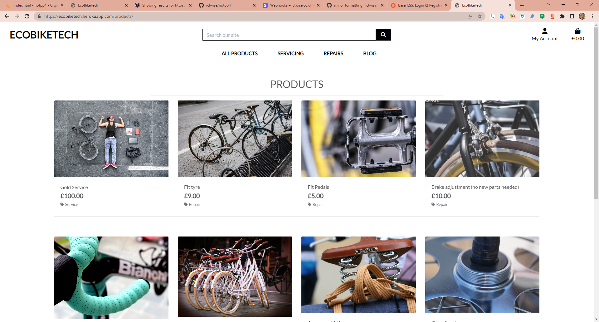
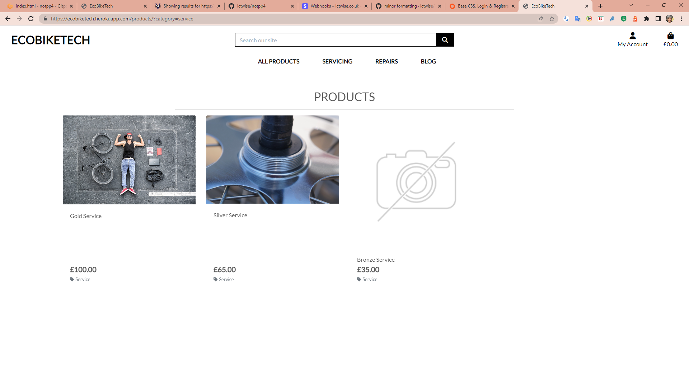
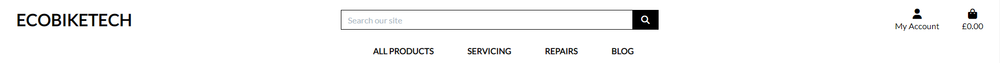
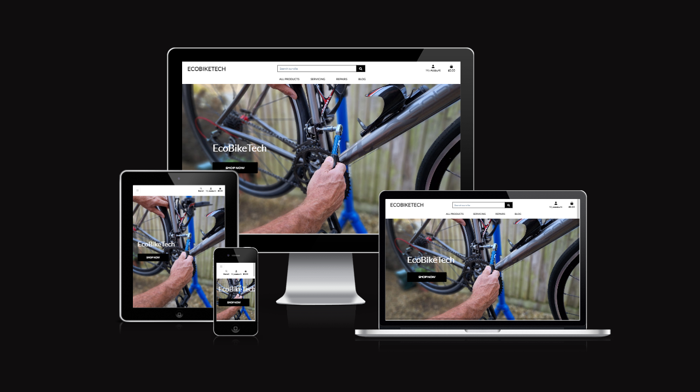

## **Contents**

- [**Manual Testing**](#manual-testing)
  - [**Browsers**](#browsers)
  - [**Devices Used**](#devices-used)
  - [**Navigation**](#navigation)
  - [**Home Page**](#home-page)
  - [**Register Page**](#register-page)
  - [**Log In Page**](#log-in-page)
  - [**Profile Page**](#profile-page)
  - [**Products Pages**](#products-pages)
    - [**Products**](#products)
    - [**Product Details**](#product-details)
    - [**Add Product**](#add-product)
    - [**Edit Product**](#edit-product)
  - [**Bag**](#bag)
  - [**Checkout**](#checkout)
  - [**Blog Page**](#blog-page)
- [**User Stories Testing**](#user-stories-testing)
- [**Wave**](#wave)
- [**Lighthouse**](#lighthouse)
- [**Validators**](#validators)
  - [**HTML Validator**](#html-validator)
  - [**CSS Jigsaw**](#css-jigsaw)
  - [**JSHint**](#jshint)
  - [**PEP8**](#pep8])

### **Manual Testing**
#### **Browsers**
The site was tested on:
- Edge
- Google Chrome
- Firefox

#### **Devices Used**
The site was tested on these devices: Pass indicates a pass on all devices
- Huawei P30 Lite
- Samsung 20
- Windows Laptop - windows 11

### User Stories Testing

| User | Story | Test | Pass/Fail |
| --- | --- | --- | --- |
| As a store owner | I want to be able to manage the product inventory, including the ability to add products, in order to keep their offerings up-to-date and accurate. | Only logged in store owners can add product - Add product cannot be reached by typing in address unless a super user is logged in, link is only show to susperusers |   Pass |
| | I wish to have the ability to change product prices, descriptions, images, and other criteria as needed, in order to keep my store up to date and accurate.| Only logged in store owners can edit products - cannot be reached by typing in address unless a super user is logged in, link is only show to susperusers|  Pass |
| | I want the ability to remove products that are no longer available for sale, in order to keep my store's inventory current and accurate.| Only logged in store owners can delete products - cannot be reached by typing in address unless a super user is logged in, link is only show to susperusers | When the link is typed, and a superuser is not logged in the login page is returned. Edit/ Delete links only appear on the products pafe when a super user is logged in, delete deletes the product it is under.   Pass |
| | I want to be able to provide secure payment options for my customers, in order to ensure their personal and financial information is protected and to build trust with them.| Payments are processing in Stripe | Pass |
| |I want to be able to add interesting and relevant blog posts to the website in order to drive traffic and engage potential customers. | Only logged in store owners can create/edit/delete Posts | When the link is typed, and a superuser is not logged in the login page is returned if the superuser is logged in a link shows on the menu and the post can be saved with or without images. Only superusers see the edit delete links. Both Edit and Delete work.     Pass |
| As a shopper |I wish to be able to view a list of products, so that I can select  items to purchase|  Products page loads |  Pass || 
| |I wish to be able to view individual product details, so that I can identity the price, description and view the product image (where one is available)| Product details page loads | Pass  || 
 | | I wish to be able to easily view the total of my purchases at any time, so that I can control my shops and avoid spending too much| Basket tracks total |   Pass |
| |I wish to be able to sort a specific category of products, so that I can find the product in a specific category|  Sort for repair and service works |    Pass |
|| I wish to be able to search for a product by name or description, so that I can find the product I wish to buy according to my personal needs| Search works on both product title and description |  Pass |
|| I wish to be able to easily see the quantity of a product, so that I can ensure I do not accidentally select the wrong product numbers of items| Qty displays in details page and bag|   Pass |
| | I wish to be able to view items in my bag to be purchased, so that I can identify the total cost of my purchase and all items I will receive before moving to the final checkout | Bag shows products and quantity and total | Pass |
| | I wish to be able to adjust the number of individual items in my bag, so that I can easily make changes to my purchase before checkout| Quantity adjusts up and down |  Pass |
|| I wish to be able to easily enter my payment information, so that I can check out quickly and with no hassles| Payment form works (order has been created in database) |  Pass |
|| I wish to be able to feel that my personal and payment information is safe, and secure, so that I can confidently provide the needed information to make a purchase| Messages tell user what is happening | Stripe offers a secure environment, information is communicated to customers through toasts in a reassuring manner. Pass |
|| I wish to be able to view an order confirmation after checkout, so that I can verify that I have not made any mistakes in my order| Email confirmation sent |  Pass |
| As a user of the website| I wish to have an intuitive navigation menu, so that I can quickly access different sections of the site| All links in navigation (including mobile) working |  Pass |
| |  I wish that design is responsive, so I can look at the page on different sizes of devices| Site looks good on different devices | Pass |
|| I wish to be able to create comment on a post, so I can share an opinion about the post with other users| Comments are added | Pass |
|| I wish to be able to easily register for an account, so that I can have a personalized account and be able to view and update my profile| Can register, email link to confirm email,  profile saved |  Pass |  I wish to be able to easily login or logout, so that I can access my personal account information and update them if needed | Login and update profile |   Pass |
||  I wish to be able to easily recover my password in case I forget it, so that I can recover access to my account| Password recovery link working |   Pass |
| |   I wish to be able to receive an email confirmation after registering, so that I can verify that my account registration was successful| Emails received |   Pass |
| | I wish to be able to have a personalized user profile so that I can view my personal order history and order confirmations, and save my payment information| Order history visable |   Pass |

[Back to contents](#contents)

### **Lighthouse**

Lighthouse testing was completed on all pages of the site
- [Home]
- [Products]
- [Product Detail]
- [Bag]
- [Checkout]
- [Checkout Success]
- [Profile]
- [Blog]
- [Post Detail]
- [Add Blog Post]
- [Add Product]

### **Validators**

#### **HTML Validator**
HTML validator was used for all pages and only one minor warning about the use of h1 element as this is used for the title but not the first child of the section. The section and h1 were used for accessibility reasons and this warning is very minor so the structure was kept in place.
- [Home]
- [Products]
- [Product Detail]
- [Bag]
- [Checkout]
- [Checkout Success]
- [Profile]
- [Blog]
- [Post Detail]
- [Add Blog Post]
- [Edit Blog Post]
- [Add Product]
- [Edit Product]

#### **CSS Jigsaw**
CSS Jigsaw validation passed for all pages
- [checkout.css]

- [base.css]

#### **JSHint**
JavaScript JSHint validator passed for all pages
- [base.js]
- [back-to-top.js]
- [modal.js]
- [sort-selector.js]
- [uni-form-validation.jquery.js]

#### **PEP8**

No errors

[Back to contents](#contents)
 
